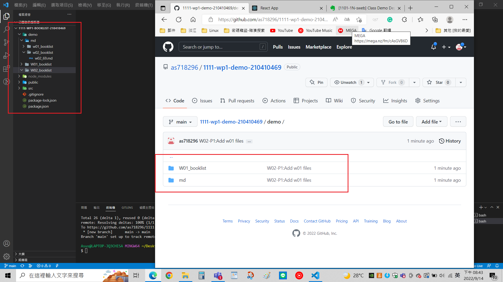

### W02-P1: Add w01 files

### W02-P2: Add two more books, marked books based on your ID's last digit

### W02-P3: Add two more books (total = 5 books), marked 4th or 5th book based on your ID's last digit

### W02-P4: Make components -- Booklist_xx.js, Book_xx.js, data.js, App_xx.js

### W02-P5: copy W02 files to demo/w02_booklist

### W02-P6: All logs

