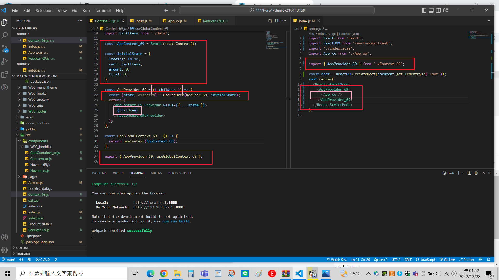
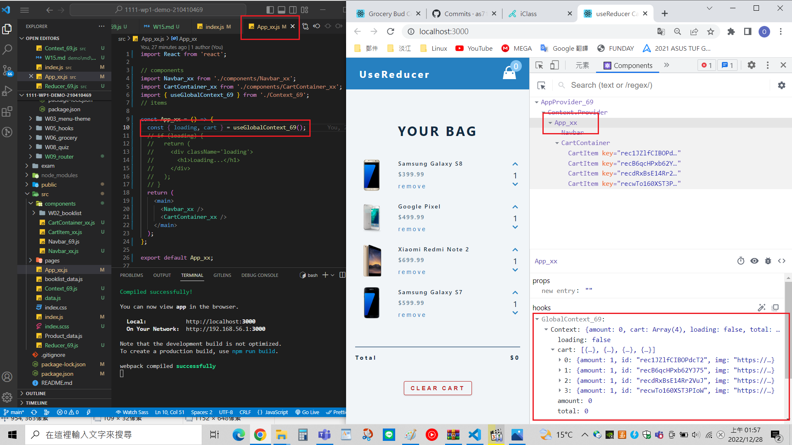
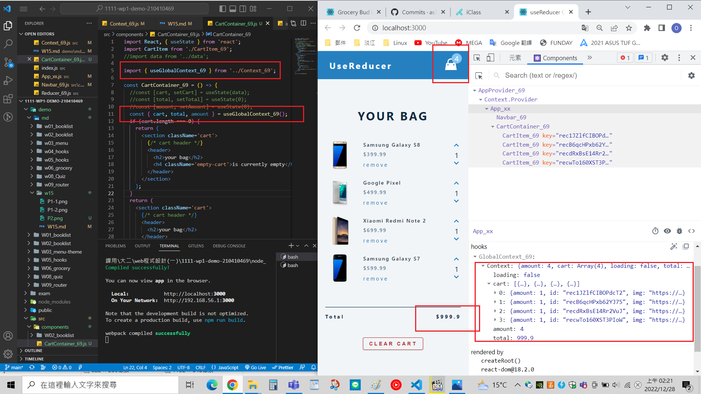

[Github URL](https://github.com/as718296/1111-wp1-demo-210410469.git)

### W15-P1: Setup AppProvider_xx for App_xx and get state data

### W15-P2: replace data in CartContainer using global context

